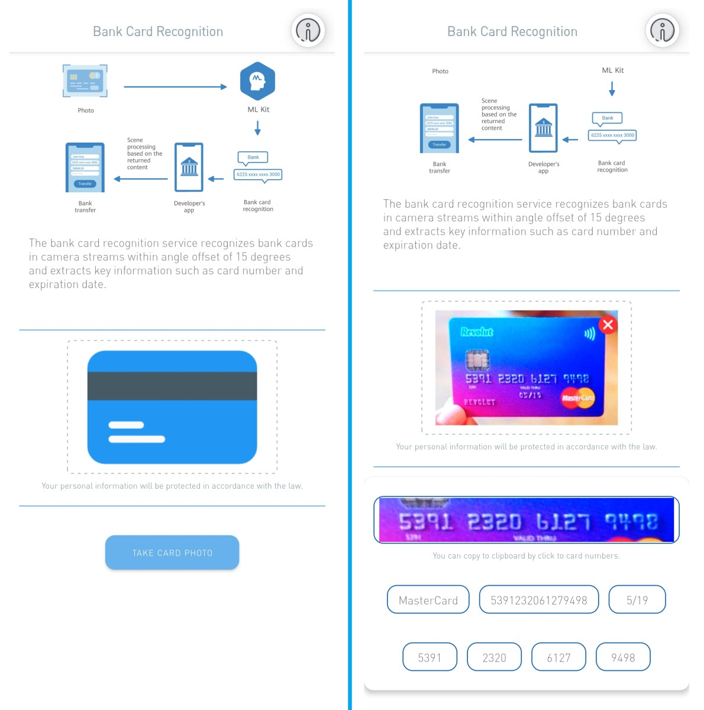

 
 
# BankCardRecognitionCodelab

  

  

  

## :notebook_with_decorative_cover: [Introduction](#introduction)

The bank card recognition service can quickly recognize information such as the bank card number, covering mainstream bank cards such as China UnionPay, American Express, Mastercard, Visa, and JCB around the world.

It is widely used in finance and payment scenarios requiring bank card binding to quickly extract bank card information, realizing quick input of bank card information.

## :information_source: [Things to Know](#things-to-know)

- Since the application is written entirely in HMS, you must have HMS Core installed on your device.

- For Android devices without HMS Core, you can download the latest version from this link; https://tik.to/9l6

- ML Kit - Text Related Service feature - BCR : Bank Card Recognition - uses camera stream.

## :notebook_with_decorative_cover: [Getting Started and Integration](#integration)

- Before getting started, Sign In/Register to [Huawei Developer](https://developer.huawei.com/consumer/en/) website and click to [Developer Console](https://developer.huawei.com/consumer/en/console)

- Click to the AppGallery Connect button in order to access [AppGallery Connect](https://developer.huawei.com/consumer/cn/service/josp/agc/index.html)

- Click My projects button to create new project or add new app to existing your projects. ( [Create an app](https://developer.huawei.com/consumer/en/doc/distribution/app/agc-create_app) )

- If the app creation is successful the page will navigate you to the App Information page. On this page, you can find your **APP ID** and **APP SECRET** of your application.

- Add the application package name to the app on the developer console

- Make enable necessary SDKs with follow this steps; My Apps -> Select App -> Project Settings -> Manage APIs.

For this project you have to set enable ML Kit

- Edit DataStorageLocation on developer console

-  **You need to agconnect-services.json for run this project correctly.**

- Go Project Settings page and click “agconnect-services.json” button for download json file.

- Move to json file in base “app” folder that under your android project. ( [like this](https://developer.huawei.com/consumer/en/doc/development/HMS-Guides/69407812#h1-1577692046342) )

- Generate and Configure the Signing Certificate (Keystore) for your application. [click here](https://medium.com/@corruptedkernel/android-creating-a-signing-certificate-keystore-and-signing-your-apk-fa67fdd27cf) to go related page. [click here](https://medium.com/@corruptedkernel/android-creating-a-signing-certificate-keystore-and-signing-your-apk-fa67fdd27cf) to go related article.

- Generating SHA-256 Fingerpring from Signing Certificate (Keystore). [click here](https://developer.huawei.com/consumer/en/codelab/HMSPreparation/index.html#2) to go related page. [click here](https://medium.com/@corruptedkernel/android-generating-fingerprint-from-a-keystore-jks-file-b624bacd90fd) to go related article.

- Add and Maven repository address implementation in the project-level(root-level) build.gradle file.

- Add and configure plug-in dependency implementation in the app-level build.gradle file.(usually app/build.gradle)

- For more details

[Preparations for Integrating HUAWEI HMS Core](https://developer.huawei.com/consumer/en/codelab/HMSPreparation/index.html#0)

[Integrating Your Apps With Huawei HMS Core](https://medium.com/huawei-developers/android-integrating-your-apps-with-huawei-hms-core-1f1e2a090e98)

  

## :star2::link: [Useful Links](usefull-links) 

* [ML Kit Functions](https://developer.huawei.com/consumer/en/hms/huawei-mlkit)

*  [ML Kit Guide](https://developer.huawei.com/consumer/en/doc/HMSCore-Guides-V5/service-introduction-0000001050040017-V5)

*  [Version Change History](https://developer.huawei.com/consumer/en/doc/HMSCore-Guides-V5/version-changehistory-0000001050040023-V5)

*  [Integrating Build Dependencies V5](https://developer.huawei.com/consumer/en/doc/HMSCore-Guides-V5/overview-sdk-0000001051070278-V5)

*  [Samples on Developer Page](https://developer.huawei.com/consumer/en/doc/development/HMS-Examples/ml-samplecode-4)

*  [Samples on Github](https://github.com/HMS-Core/hms-ml-demo)

*  [Medium Page EN](https://medium.com/huawei-developers)

*  [Medium Page TR](https://medium.com/huawei-developers-tr) * [Developers Forum](https://forums.developer.huawei.com/forumPortal/en/home)

## :information_source: [Licence](licence)

Copyright 2020. Huawei Technologies Co., Ltd. All rights reserved.

Licensed under the Apache License, Version 2.0 (the "License");

you may not use this file except in compliance with the License.

You may obtain a copy of the License at

http://www.apache.org/licenses/LICENSE-2.0

Unless required by applicable law or agreed to in writing, software

distributed under the License is distributed on an "AS IS" BASIS,

WITHOUT WARRANTIES OR CONDITIONS OF ANY KIND, either express or implied.

See the License for the specific language governing permissions and

limitations under the License.